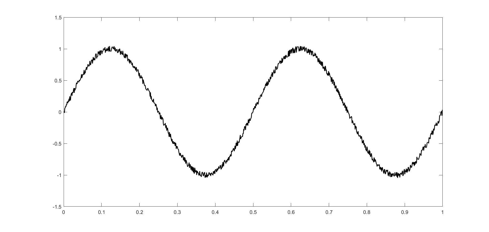
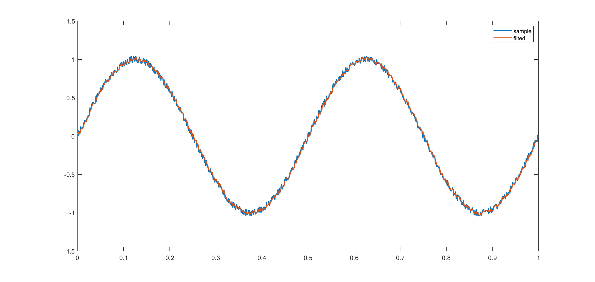
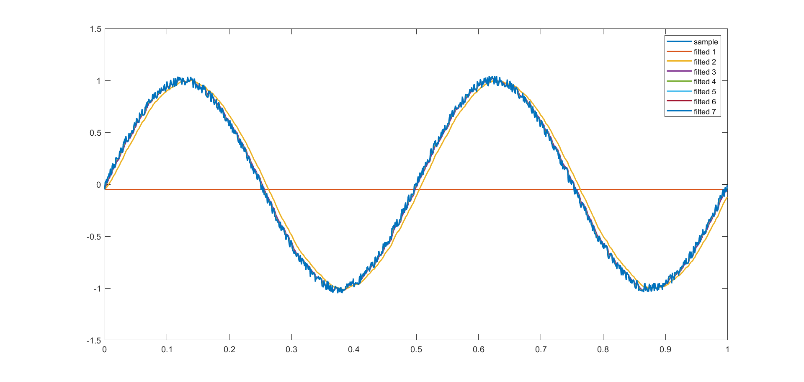

# 滤波器技术分享(1)：一阶低通滤波器的实现


## 0.问题引入：滤波器最初的构想

在实际控制系统中，往往会得到一些存在噪声的信号，而系统中不希望对这样的信号进行控制。直观上说，我们希望“过滤”掉带有噪声的那部分，保留剩余的主信号。比如下面这条带有噪声的轨迹：



在时域上，所谓"滤波"最朴素的思路是：在采集到当前信号时，将当前信号乘一个权重系数A，和之前的信号乘一个权重系数B（权重系数之和为1），将二者求和来弱化噪声对信号的影响。这里的描述引入了两个问题：

- 权重系数取多少才合适？
- 所谓“之前的信号”，取在此之前的多少个点才合适？

由于本文仅讨论一阶低通滤波器的问题，在此仅取之前的一个点作为参考，至于更多取值的问题将来再讨论。下面我们关注第一个问题：权重系数的取值。

继续我们朴素的思路，取$A=0.5,B=0.5$，也即当前信号权重和过往信号权重相当的情况，进行"滤波"试一试。下面记$x_3(n)$为第n个采样数据，$x_3'(n)$为第n个滤波数据，观察他们的区别。

第一个采样点：$x_3(1)=0.0300$，由于没有上一个采样点，$x_3'(1)=x_3(1)=0.0300$

第二个采样点：$x_3(2) = 0.0256$，$x_3'(2) = (x_3(2) + x_3'(1))/2=0.0278$

第三个采样点：$x_3(2) = 0.0734$，$x_3'(2) = (x_3(2) + x_3'(1))/2=0.0506$

依次类推，以MATLAB的形式给出上述表达：

```
x_ = nan(length(x), 1);
x_(1) = x3(1);
for i = 2 : length(x)
    x_(i) = 0.5 * x(i) + 0.5 * x_(i - 1);
end
```

得到"滤波"后的效果如下：



不难看出，上述滤波几乎没有效果，问题显然出在权重系数的取值上，下面分别按照如下方式取值，对比结果：

| 权重系数 | 1    | 2    | 3    | 4    | 5    | 6    | 7    |
| -------- | ---- | ---- | ---- | ---- | ---- | ---- | ---- |
| $A$      | 0.0  | 0.1  | 0.3  | 0.5  | 0.7  | 0.9  | 1.0  |
| $B$      | 1.0  | 0.9  | 0.7  | 0.5  | 0.3  | 0.1  | 0.0  |

七组滤波器的效果如下：



放大其中一个局部：


我们从上述曲线可以得到以下结论：

- 第1组滤波器采取的手段过于激进，仅考虑之前的数据，而全盘舍弃当前的采样值，导致滤波得到的结果为一条水平直线，其数值等于采样的第一个点
- 第7组滤波器采取的手段过于保守，仅考虑当前采样值，其结果和未滤波完全一样。
- 第2组滤波器从直观上看，我们觉得效果不错，但是有明显的延迟
- 第3~6组滤波器的结果都看不清，即使能够放大看清楚，也很难量化评价其优劣性

事实上，这已经实现了一组低通滤波器，遗留了两个主要问题：如何调整权重系数？如何量化评价滤波器效果？我们将来讨论，下面关注这一滤波器在单片机上的实现。

## 1.基于FatTest的离线滤波

FatTest是自研测试框架，其基于文件管理系统FatFS进行文件的读取和写入，并用串口将数据实时打印到上位机。相比于常用的开源测试框架Unity, gtest等，其主要的优点有：

- 和硬件完全解耦，可以复用在任意型号的单片机上
- 基于FatFS可以在测试用例中进行数据文件的读写
- 结合Vofa+或其他串口工具可以实时打印数据和曲线，实现可视化
- 代码完全开源

其测试流程如下：

#### 读取数据文件


#### 数据导入滤波


#### 仿真串口输出


#### 保存输出文件


