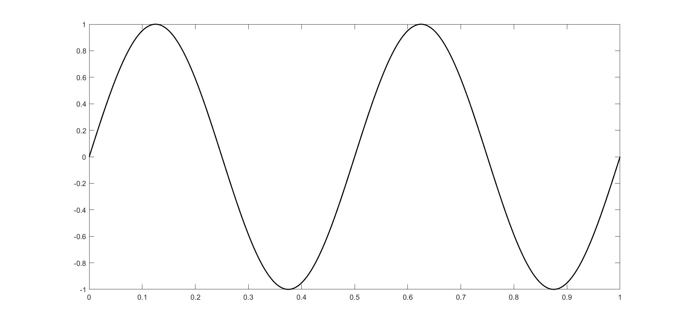
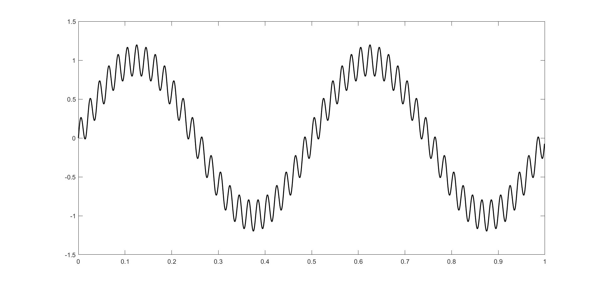
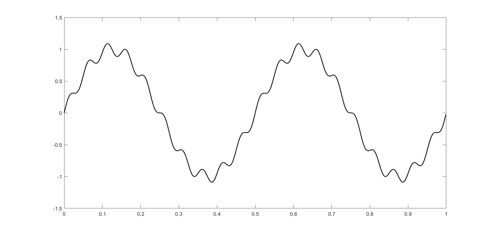
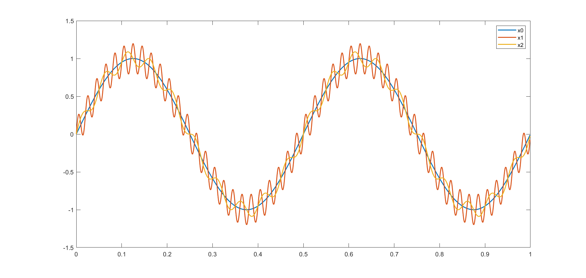
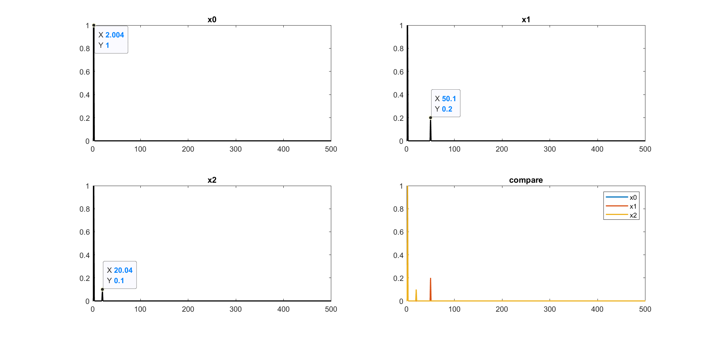
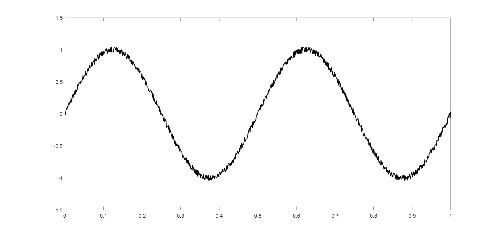
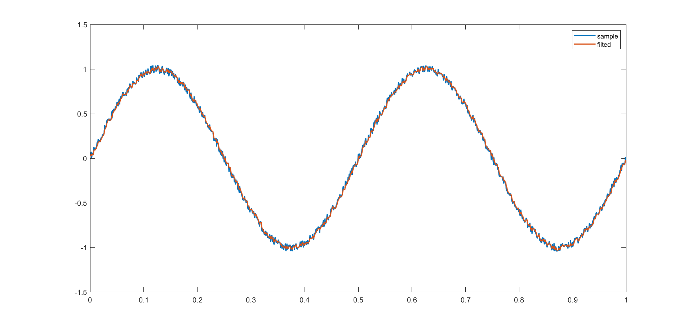
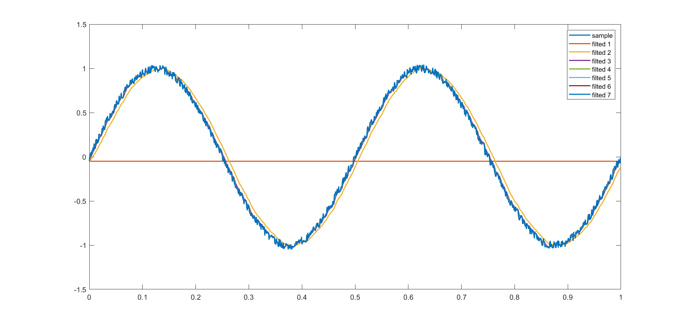
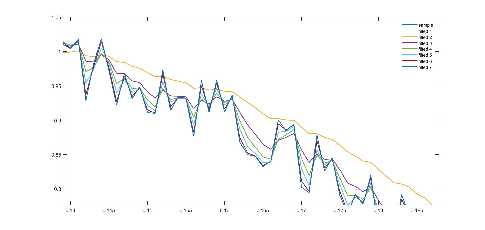

# 自动控制原理入门及实现：一阶低通滤波器(1)


## 1.问题引入：描述一条带有噪声的轨迹

我们任意给定一条关于时间$t$正弦轨迹$x_0(t)$：
$$
x_0(t)=\sin(4\pi t)
$$
对于$t\in[0, 1]$，按照每步$\delta t = 10^{-3}$为间隔取点，可以得到如下轨迹：



但因为各种现实的因素，我们在真实环境中采集到的数据不可避免地存在噪声，假设我们用了两类传感器，分别采集到的信号如下：





可以看出，上面的两组带噪声轨迹，噪声的幅值和频率似乎都不相同，到底哪一组轨迹“好”，哪一组轨迹“坏”，似乎很难直接从图上看到。最简单的，我们可以把三组轨迹放在一起对比看一看：



这样似乎显得更加迷惑了：直观上来说，$x_1$的噪声幅值似乎更大，$x_2$的噪声频率似乎更低（看起来噪声变化的比较慢），但如何准确的描述他们呢？

百年前的学者们研究出了在频域下描述轨迹的方法，发展到今天也就是常说的**傅里叶变换**，MATLAB官方提供了快速傅里叶变换的[接口](https://ww2.mathworks.cn/help/matlab/ref/fft.html?s_tid=doc_ta)`fft()`，我们将上述轨迹分别做傅里叶变换，结果如下：



上图中横坐标为频率/Hz，纵坐标为幅值。不难看出，三组信号在时域上都是由频率为2Hz，幅值为1的正弦信号构成的，带有噪声的信号在频域图上也可以清晰的看出：$x_1$除了主信号外，还伴随着频率为50Hz，幅值为0.2的正弦信号；$x_2$除了主信号外，还伴随着频率为20Hz，赋值为0.1的正弦信号。

上面的结论量化评价了信号噪声的问题。可以看出，噪声在频域上的两个主要指标是频率和幅值，可以用傅里叶变换得到。

## 1.问题引入：滤波器最初的构想

在实际控制系统中，往往会得到一些存在噪声的信号，而系统中不希望对这样的信号进行控制。直观上说，我们希望“过滤”掉带有噪声的那部分，保留剩余的主信号。比如下面这条带有噪声的轨迹：



在时域上，所谓"滤波"最朴实的思路是：在采集到当前信号时，将当前信号乘一个权重系数A，和之前的信号乘一个权重系数B（权重系数之和为1），将二者求和来弱化噪声对信号的影响。这里的描述引入了两个问题：

- 权重系数取多少才合适？
- 所谓“之前的信号”，取在此之前的多少个点才合适？

由于本文仅讨论一阶低通滤波器的问题，在此仅取之前的一个点作为参考，至于更多取值的问题将来再讨论。下面我们关注第一个问题：权重系数的取值。

继续我们朴素的思路，取$A=0.5,B=0.5$，也即当前信号权重和过往信号权重相当的情况，进行"滤波"试一试。下面记$x_3(n)$为第n个采样数据，$x_3'(n)$为第n个滤波数据，观察他们的区别。

第一个采样点：$x_3(1)=0.0300$，由于没有上一个采样点，$x_3'(1)=x_3(1)=0.0300$

第二个采样点：$x_3(2) = 0.0256$，$x_3'(2) = (x_3(2) + x_3'(1))/2=0.0278$

第三个采样点：$x_3(2) = 0.0734$，$x_3'(2) = (x_3(2) + x_3'(1))/2=0.0506$

依次类推，以MATLAB的形式给出上述表达：

```
x_ = nan(length(x), 1);
x_(1) = x3(1);
for i = 2 : length(x)
    x_(i) = 0.5 * x(i) + 0.5 * x_(i - 1);
end
```

得到"滤波"后的效果如下：



不难看出，上述滤波几乎没有效果，问题显然出在权重系数的取值上，下面分别按照如下方式取值，对比结果：

| 权重系数 | 1    | 2    | 3    | 4    | 5    | 6    | 7    |
| -------- | ---- | ---- | ---- | ---- | ---- | ---- | ---- |
| $A$      | 0.0  | 0.1  | 0.3  | 0.5  | 0.7  | 0.9  | 1.0  |
| $B$      | 1.0  | 0.9  | 0.7  | 0.5  | 0.3  | 0.1  | 0.0  |

七组滤波器的效果如下：



放大其中一个局部：



我们从上述曲线可以得到以下结论：

- 第1组滤波器采取的手段过于激进，仅考虑之前的数据，而全盘舍弃当前的采样值，导致滤波得到的结果为一条水平直线，其数值等于采样的第一个点
- 第7组滤波器采取的手段过于保守，仅考虑当前采样值，其结果和没有滤波完全一样。
- 第2组滤波器从直观上看，我们觉得效果不错，但是有明显的延迟
- 第3~6组滤波器的结果都看不清，即使能够放大看清楚，也很难量化其优劣性

